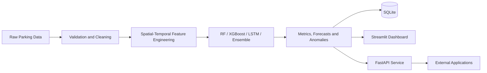

# Smart Parking Intelligence for Indian Urban Areas

An end-to-end data-science system for parking-demand analysis, multi-horizon occupancy forecasting, anomaly detection, and risk-aware parking recommendations.

> **Project type:** Applied machine-learning and data-engineering project  
> **Core stack:** Python, pandas, scikit-learn, XGBoost, TensorFlow/Keras, SQLite, FastAPI, Streamlit, Docker  
> **Focus areas:** Time-series forecasting, spatial-temporal features, model comparison, APIs, dashboards, and deployment

## Project Overview

The project processes the `parkingStream_2.csv` dataset, corrects data-quality problems, engineers spatial and temporal features, trains multiple forecasting models, stores analytical outputs in SQLite, and exposes results through a Streamlit dashboard and FastAPI service.

Unlike a simple occupied-versus-empty classifier, the primary target is future **parking utilization**, allowing the system to estimate congestion pressure across parking locations with different capacities.

## Core Highlights

- Parking data covering **14 parking systems** with time-series utilization records
- Validation and correction of occupancy-versus-capacity inconsistencies
- Spatial-temporal features using neighboring parking pressure and previous-day same-slot memory
- Forecast horizons of **30 minutes, 1 hour, and 2 hours**
- Calibrated uncertainty intervals for advanced forecasts
- Risk-aware recommendation engine for ranking available parking options
- Anomaly detection for unusual demand patterns
- SQLite-backed analytical queries
- Interactive Streamlit dashboard
- FastAPI endpoints with automatically generated OpenAPI documentation
- Docker and Render deployment configuration

## Models

The forecasting pipeline compares:

- Persistence baseline
- Random Forest
- XGBoost
- LSTM
- Weighted ensemble

The repository also includes KMeans clustering and PCA for exploratory segmentation and dimensionality reduction.

## High-Level Architecture



## Repository Structure

```text
smart-city-parking-occupancy-prediction/
├── data/
│   ├── raw/                         # Source parking dataset
│   └── processed/                   # Cleaned and model-ready data
├── artifacts/
│   ├── models/                      # Trained model artifacts
│   ├── plots/                       # Generated visualizations
│   ├── reports/                     # Metrics, forecasts and recommendations
│   └── db/smart_parking.db          # SQLite analytics database
├── src/smart_parking/               # Reusable data and modeling modules
├── scripts/run_pipeline.py          # Full pipeline entry point
├── scripts/run_api.py               # FastAPI entry point
├── dashboard/app.py                 # Streamlit dashboard
├── docs/                            # Supporting documentation
├── Dockerfile                       # API container image
├── render.yaml                      # Render deployment configuration
└── requirements.txt                 # Python dependencies
```

## Local Setup

### 1. Clone the repository

```bash
git clone https://github.com/AKSHATSPAR/smart-city-parking-occupancy-prediction.git
cd smart-city-parking-occupancy-prediction
```

### 2. Create a virtual environment

```bash
python -m venv .venv
```

Activate it:

**macOS/Linux**

```bash
source .venv/bin/activate
```

**Windows PowerShell**

```powershell
.venv\Scripts\Activate.ps1
```

### 3. Install dependencies

```bash
python -m pip install --upgrade pip
pip install -r requirements.txt
```

On macOS, XGBoost or related native dependencies may require OpenMP:

```bash
brew install libomp
```

## Run the Pipeline

```bash
python scripts/run_pipeline.py
```

The pipeline prepares data, trains the configured models, evaluates forecasts, and writes outputs under `data/processed/` and `artifacts/`.

## Launch the Dashboard

```bash
streamlit run dashboard/app.py
```

## Run the API

```bash
python scripts/run_api.py
```

API documentation will be available at:

- `http://127.0.0.1:8000/docs`
- `http://127.0.0.1:8000/openapi.json`

## Main Prediction Target

The primary target, `target_utilization_1h`, represents the parking-lot utilization ratio one hour after the current observation. This supports capacity-aware forecasting and is more informative than predicting only whether a facility is occupied or empty.

## Important Outputs

- `artifacts/reports/multi_horizon_metrics.csv` — forecast performance across horizons
- `artifacts/reports/parking_recommendations.csv` — risk-aware ranked parking options
- `artifacts/reports/demand_anomalies.csv` — detected abnormal demand events
- `data/processed/spatial_neighbor_graph.csv` — nearest-neighbor graph used for spatial context

## Docker / Deployment

The repository includes a `Dockerfile` and `render.yaml` for publishing the FastAPI service.

A typical Render deployment flow is:

1. Connect the GitHub repository to a new Render web service.
2. Build using the root `Dockerfile`.
3. Deploy the service.
4. Open `https://<your-service>.onrender.com/docs` for the Swagger interface.

## Limitations and Future Work

- Forecast quality depends on the coverage and representativeness of the source dataset.
- Real deployment would require continuously refreshed occupancy feeds.
- Spatial distance and traffic-time features could improve recommendation quality.
- Model monitoring and periodic retraining would be necessary as demand patterns change.
